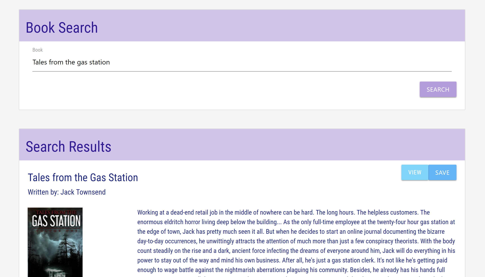

# Boogle

[Boogle](https://boogle-search.herokuapp.com/) is a React-based app that allows users to search for search for and save books via the [Google Books API](https://developers.google.com/books/).

## Instructions

### Search for Books

1. Go to [Search](https://boogle-search.herokuapp.com/search) to look for books.
2. Type a book title or author into the **Book Search** section.
3. Results will appear in the **Search Results**.
4. Click the **View** button to view the book's Google Books page.
5. Click the **Save** button to save a book.

### Saved Books

1. Go to [Saved](https://boogle-search.herokuapp.com/saved) to look at the currently saved books.
2. Click the **View** button to view the book's Google Books page.
3. Click **Delete** to remove the book from the saved books page.